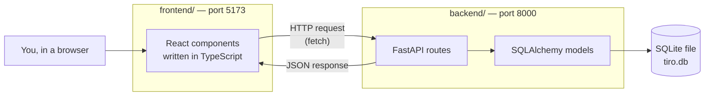

# 00 — Orientation

**Goal:** before touching any code, understand what the pieces are, how
they talk to each other, and what "test-driven development" means.

No commands in this lesson. Read it, answer the questions at the end,
and move on.

---

## The big picture

A web app is two programs talking to each other over HTTP.



Follow one action all the way through — **adding an application**:

1. You fill in a form in the browser and click **Add application**.
2. A **React component** collects what you typed.
3. It calls `fetch`, which sends an **HTTP POST request** containing
   JSON to `http://localhost:8000/applications`.
4. **FastAPI** receives the request and uses a **Pydantic schema** to
   check the JSON has the right fields and types.
5. FastAPI hands the data to **SQLAlchemy**, which turns a Python
   object into a SQL `INSERT` statement.
6. **SQLite** stores the row in the file `tiro.db`.
7. FastAPI sends back the saved row as JSON with status `201 Created`.
8. React adds it to the list on screen.

Every lesson builds one link in that chain.

### Where the other tools fit

These don't appear in the diagram because they don't run in the app —
they help *you* build it.

| Tool | Job |
| --- | --- |
| **uv** | Installs Python and the backend's packages into an isolated folder (`.venv`) |
| **npm** | Installs the frontend's packages into `node_modules` |
| **Vite** | Runs the frontend dev server and reloads the page when you save |
| **Alembic** | Applies changes to the database's structure, in order, like commits |
| **pytest / Vitest** | Run your tests |
| **Husky** | Runs your tests before Git lets you commit |

---

## Test-driven development (TDD)

TDD flips the usual order. Instead of *write code, then check it*, you:

1. **🔴 Red** — Write a small test describing one thing the code should
   do. Run it. It **fails**, because the code doesn't exist yet.
2. **🟢 Green** — Write the *smallest* amount of code that makes the
   test pass. Not elegant, not complete — just passing.
3. **🔵 Refactor** — Clean up the code (names, duplication, structure).
   Run the tests again. They must stay green.

Then repeat with the next small thing.

### Why bother?

- **You always know if your code works.** The tests say so, not a
  person, not an AI.
- **Seeing red first proves the test can fail.** A test that has never
  failed might not be testing anything.
- **Small steps are easier to debug.** If a test breaks, the problem
  is in the last few lines you wrote.
- **You can change code without fear.** If you refactor and break
  something, a test turns red immediately.

Kent Beck, who popularized TDD, summarized the order of priorities as
"Make it work, make it right, make it fast." Red-green is *make it
work*. Refactor is *make it right*.

### What a test looks like

Every test has three parts, often called **Arrange, Act, Assert**:

```text
Arrange:  set up what the test needs
          (e.g. an empty database)
Act:      do the one thing being tested
          (e.g. send a POST request)
Assert:   check the result
          (e.g. status code is 201)
```

You'll see this shape in every test in this repo.

---

## Test coverage

**Coverage** measures which lines of your code ran during your tests.
If a line never ran, no test checked it.

- 100% coverage does *not* mean your code is correct.
- 0% coverage on a file *does* mean nothing checks it.

The **Coverage Gutters** extension paints each line in your editor
green (ran during tests) or red (didn't). You'll set it up in lessons
03 and 06.

---

## How the folders will look when you're done

```text
gradus-i-tiro/
├── .husky/            ← Git hooks (pre-commit)
├── .vscode/           ← Editor settings and extensions
├── backend/
│   ├── app/           ← FastAPI app, models, schemas
│   ├── migrations/    ← Alembic migration files
│   ├── tests/         ← pytest tests
│   └── pyproject.toml ← Python dependencies and settings
├── frontend/
│   ├── src/           ← React components and their tests
│   └── package.json   ← Frontend dependencies and scripts
├── guide/             ← These lessons
└── package.json       ← Repo-level scripts (Husky)
```

---

## Explain it back

Answer each in your own words *before* opening the answer.

**1. When you click "Add application", which program saves the data —
the frontend or the backend?**

<details>
<summary>Answer</summary>

The backend. The frontend only collects your input and sends it over
HTTP. FastAPI receives it, SQLAlchemy writes it, and SQLite stores it.
The frontend never touches the database directly.
</details>

**2. Why do you run a test and watch it fail before writing the code?**

<details>
<summary>Answer</summary>

To prove the test can actually detect a problem. If a test passes
before the code exists, it's broken — it would pass no matter what.
</details>

**3. Your coverage report says 100%. Does that mean there are no bugs?**

<details>
<summary>Answer</summary>

No. Coverage only proves lines *ran* during tests. A line can run and
still do the wrong thing if no test checks its result carefully.
</details>

**4. Name the database in this project. Is SQLAlchemy a database?**

<details>
<summary>Answer</summary>

The database is SQLite (the file `tiro.db`). SQLAlchemy is not a
database — it's an ORM, a translator between Python objects and SQL.
</details>

---

## Checkpoint

You can sketch the request flow from browser to database from memory,
and you can explain red → green → refactor to someone else.

Next: [01 — Install your tools](01-install-tools.md)
